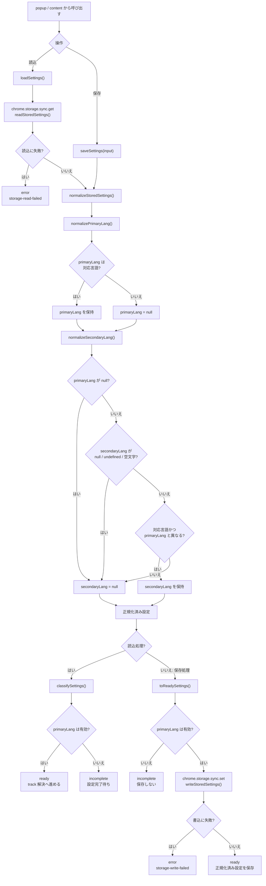

# settings-store.ts flow

`src/settings/settings-store.ts` の読込・保存・正規化の流れ。[cite:71]

```mermaid
flowchart TD
  Start["popup / content から呼び出す"] --> Operation{"操作"}

  Operation -->|読込| Load["loadSettings()"]
  Load --> StorageGet["chrome.storage.sync.get<br/>readStoredSettings()"]
  StorageGet --> ReadError{"読込に失敗?"}
  ReadError -->|はい| LoadError["error<br/>storage-read-failed"]
  ReadError -->|いいえ| Normalize["normalizeStoredSettings()"]

  Operation -->|保存| Save["saveSettings(input)"]
  Save --> Normalize

  Normalize --> Primary["normalizePrimaryLang()"]
  Primary --> PrimaryOk{"primaryLang は<br/>対応言語?"}
  PrimaryOk -->|はい| KeepPrimary["primaryLang を保持"]
  PrimaryOk -->|いいえ| NullPrimary["primaryLang = null"]

  KeepPrimary --> Secondary["normalizeSecondaryLang()"]
  NullPrimary --> Secondary
  Secondary --> PrimaryMissing{"primaryLang が null?"}
  PrimaryMissing -->|はい| NullSecondary["secondaryLang = null"]
  PrimaryMissing -->|いいえ| SecondaryEmpty{"secondaryLang が<br/>null / undefined / 空文字?"}
  SecondaryEmpty -->|はい| NullSecondary
  SecondaryEmpty -->|いいえ| SecondaryValid{"対応言語かつ<br/>primaryLang と異なる?"}
  SecondaryValid -->|はい| KeepSecondary["secondaryLang を保持"]
  SecondaryValid -->|いいえ| NullSecondary

  KeepSecondary --> Normalized["正規化済み設定"]
  NullSecondary --> Normalized

  Normalized --> FromLoad{"読込処理?"}
  FromLoad -->|はい| Classify["classifySettings()"]
  Classify --> ReadyCheck{"primaryLang は有効?"}
  ReadyCheck -->|はい| LoadReady["ready<br/>track 解決へ進める"]
  ReadyCheck -->|いいえ| LoadIncomplete["incomplete<br/>設定完了待ち"]

  FromLoad -->|いいえ: 保存処理| ToReady["toReadySettings()"]
  ToReady --> SaveReadyCheck{"primaryLang は有効?"}
  SaveReadyCheck -->|いいえ| SaveIncomplete["incomplete<br/>保存しない"]
  SaveReadyCheck -->|はい| StorageSet["chrome.storage.sync.set<br/>writeStoredSettings()"]
  StorageSet --> WriteError{"書込に失敗?"}
  WriteError -->|はい| SaveError["error<br/>storage-write-failed"]
  WriteError -->|いいえ| SaveReady["ready<br/>正規化済み設定を保存"]
```
