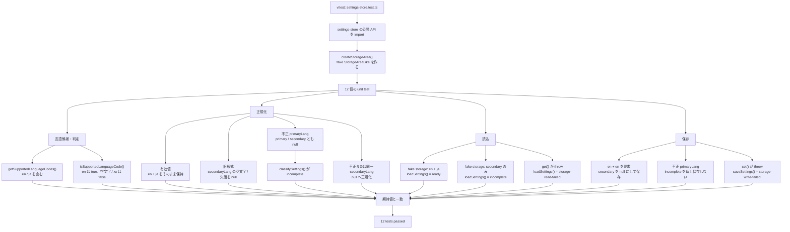

# settings-store.test.ts flow

`src/settings/settings-store.test.ts` の test 観点と実行の流れ。[cite:72]

```mermaid
flowchart TD
  Start["vitest: settings-store.test.ts"] --> Import["settings-store の公開 API を import"]

  Import --> FakeStorage["createStorageArea()<br/>fake StorageAreaLike を作る"]

  FakeStorage --> Tests["12 個の unit test"]

  Tests --> LanguageTests["言語候補・判定"]
  LanguageTests --> Supported["getSupportedLanguageCodes()<br/>en / ja を含む"]
  LanguageTests --> ValidateCode["isSupportedLanguageCode()<br/>en は true、空文字 / xx は false"]

  Tests --> NormalizeTests["正規化"]
  NormalizeTests --> ValidSettings["有効値<br/>en + ja をそのまま保持"]
  NormalizeTests --> OldFormat["旧形式<br/>secondaryLang の空文字 / 欠落を null"]
  NormalizeTests --> InvalidPrimary["不正 primaryLang<br/>primary / secondary とも null"]
  InvalidPrimary --> Incomplete["classifySettings() が incomplete"]
  NormalizeTests --> InvalidSecondary["不正または同一 secondaryLang<br/>null へ正規化"]

  Tests --> LoadTests["読込"]
  LoadTests --> LoadReady["fake storage: en + ja<br/>loadSettings() = ready"]
  LoadTests --> LoadIncomplete["fake storage: secondary のみ<br/>loadSettings() = incomplete"]
  LoadTests --> LoadFailure["get() が throw<br/>loadSettings() = storage-read-failed"]

  Tests --> SaveTests["保存"]
  SaveTests --> SaveNormalized["en + en を要求<br/>secondary を null にして保存"]
  SaveTests --> SaveRejected["不正 primaryLang<br/>incomplete を返し保存しない"]
  SaveTests --> SaveFailure["set() が throw<br/>saveSettings() = storage-write-failed"]

  Supported --> Pass["期待値と一致"]
  ValidateCode --> Pass
  ValidSettings --> Pass
  OldFormat --> Pass
  Incomplete --> Pass
  InvalidSecondary --> Pass
  LoadReady --> Pass
  LoadIncomplete --> Pass
  LoadFailure --> Pass
  SaveNormalized --> Pass
  SaveRejected --> Pass
  SaveFailure --> Pass

  Pass --> Result["12 tests passed"]
```
